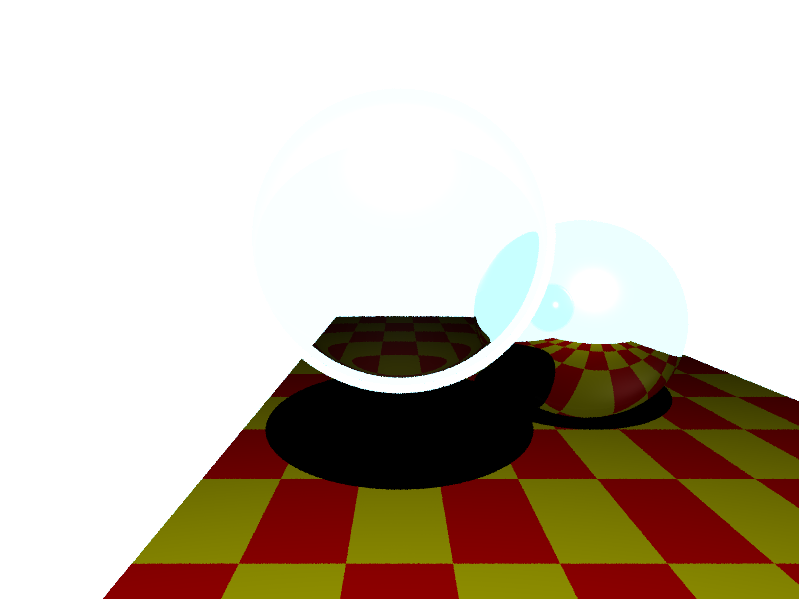
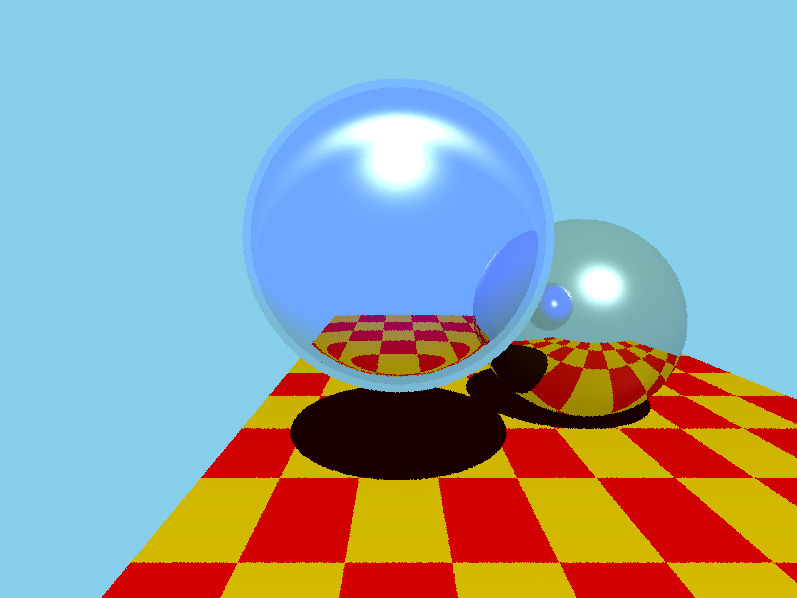
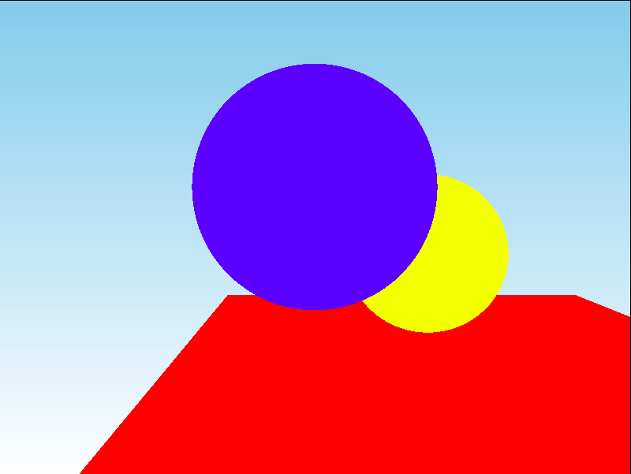

# CSCI 711: Global Illumination
This repo hosts code related to the CSCI 711 project of writing a ray tracer.

#Assignment 7: Refraction
Ward, low light wattage:

Ward, medium light wattage:

Ward, high light wattage:

Reinhard, low light wattage:

Reinhard, medium light wattage:

Reinhard, high light wattage:

#Assignment 6: Refraction
Here is the basic assignment:

# Assignment 5: Reflection
Here is the basic assignment:

Here is the same assignment, but with the sphere moved so you can see the other reflection better:

# Assignment 4: Texture
Here is the basic assignment:

# Assignment 3: Phong
This is the basic image with Phong shading.

This is Phong, with a second light source.

This is the same image, with MSAA.

# Assignment 2: Object Intersections
This is the default image perspective.

This is the camera in a different location.

# Assignment 1: Setting the Scene
https://patribas.github.io/projects/510/CSCI-510_Final_Exam.html
